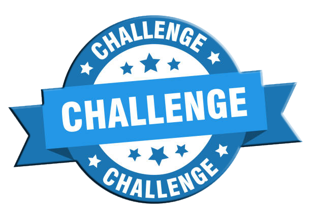

# Repositório de Desafios de Cdigo
Repositório criado para armazenar os materiais do Bootcamp Geração Tech Unimed-BH - Ciência de Dados.

<h1 align="center">
    
</h1>

<h4 align="center"> 
	:construction: Desafios de Código - Ciência de Dados :computer: In progress... :construction:
</h4>

  

  
	
  

  

  
   

